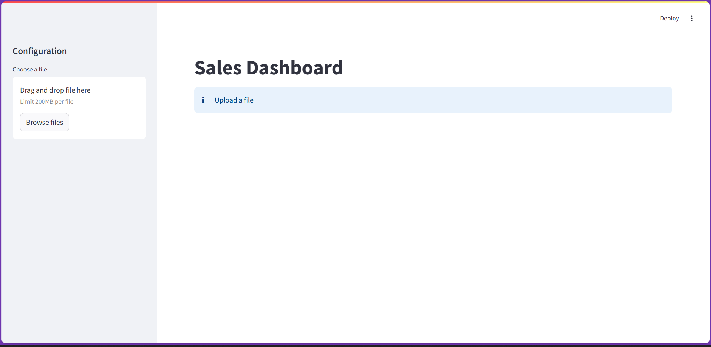
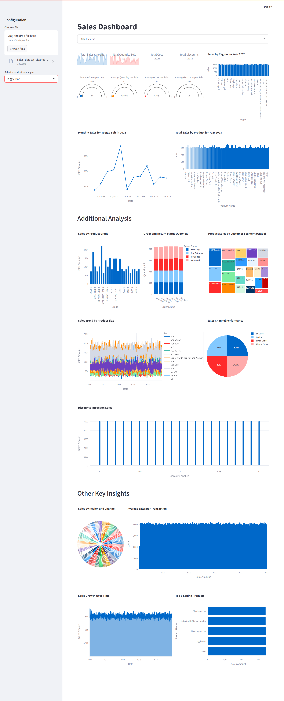

# Sales Insights Data Analysis Project for a Retail Company

## Overview

This project is a data analysis project for a retail company. The company has dataset: `sales_data.csv` that contains the sales data for the company. The objective of this project is to analyze the sales data and provide insights to the company to improve their sales.

## Demo Video
https://github.com/user-attachments/assets/ad1ca27e-4c4a-4b07-826c-d9379edbbb4d

## Screenshots

### Streamlit Web Application

## Technologies Used

- Python
- Pandas
- Plotly
- Jupyter Notebook
- Dash
- Streamlit
- DuckDB

## Features

- Data Cleaning
- Data Analysis
- Data Visualization
- Insights Generation
- Interactive Dashboards
- Interactive Web Application

## Data Analysis

- Total Sales
- Total Quantity Sold
- Total Profit
- Total Discount
- Total Customers
- Total Products Sold
- Total Categories Sold
- Total Sub-Categories Sold
- Total States Sold

## License

This project is licensed under the MIT License - see the [LICENSE](LICENSE) file for details.

## Author

- [Divya Shah](https://www.linkedin.com/in/divya-d-shah/)

## Credits

- [YouTube](https://www.youtube.com/)
- [Fanilo Andrianasolo](https://www.youtube.com/@andfanilo)
- [Streamlit](https://www.streamlit.io/)
- [Plotly](https://plotly.com/)
- [ChatGPT](https://www.openai.com/research/)
